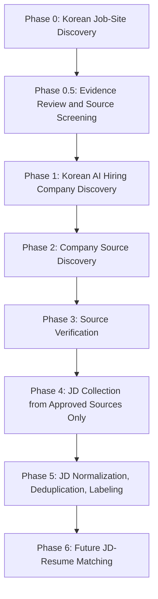

# AI Hiring Market Pipeline

Biz-Voyager-style AI hiring market data pipeline with stricter source compliance review for the HEDING x ModuLabs AIFFELTHON matching MVP and research project.

This project targets the Korean AI hiring market. Target companies are Korean companies and Korea-relevant hiring organizations. Global ATS names such as Greenhouse, Lever, Ashby, Workday, SmartRecruiters, and SAP SuccessFactors are treated only as infrastructure patterns that Korean or Korea-relevant companies may use. They are not foreign-company or foreign-market collection targets.

The long-term goal is to legally collect, validate, normalize, structure, and prepare AI-related job descriptions (JDs) from approved sources so they can later be matched with AI candidate resumes.

The project starts from Korean job-site discovery, not company discovery. JD collection is blocked until approved sources exist.

This repository is legal, conservative, evidence-first, and research-oriented. It is not designed for massive crawling, access-control bypass, or unapproved data extraction.

## Final Pipeline

```text
Phase 0 - Korean Job-Site Discovery
-> Phase 0.5 - Job-Site Evidence Review and Source Screening
-> Phase 1 - Korean AI Hiring Company Discovery
-> Phase 2 - Company Source Discovery
-> Phase 3 - Source Verification
-> Phase 4 - JD Collection from Approved Sources Only
-> Phase 5 - JD Normalization, Deduplication, Labeling
-> Phase 6 - Future JD-Resume Matching
```



Biz-Voyager starts from company discovery and official hiring-source verification. This project adds an earlier Korean job-site universe discovery and screening layer before company discovery, because Korean AI hiring intelligence needs a broader source universe and stricter source compliance gates before any JD collection.

## Operating Model

The project follows a Biz-Voyager-inspired model:

```text
broad discovery
-> evidence review
-> screening
-> staging
-> quality gate
-> master
```

The project adds stricter Korean source compliance rules:

- discovered sites are not approved sources
- screened sites are not automatically collectable
- company candidates require traceable AI hiring evidence
- source approval is mandatory before JD collection
- no source is used when robots.txt, Terms of Service, login, CAPTCHA, anti-bot controls, or access restrictions block collection
- no source is approved from fake, untraceable, or invented evidence

## Korean Market Scope

The repository targets:

- Korean job posting websites
- Korean company official career pages
- Korea-relevant ATS-backed hiring endpoints
- official APIs where available and approved
- public ATS/API endpoints where allowed
- JSON/RSS feeds where allowed
- sitemap-discoverable public job pages where allowed

The project does not target broad foreign job markets. If a global ATS appears, it is handled as hiring infrastructure used by Korean or Korea-relevant organizations.

See [docs/korean_market_scope.md](docs/korean_market_scope.md).

## Phase Summaries

### Phase 0 - Korean Job-Site Discovery

Discover Korean job posting websites broadly. This phase discovers possible job-site sources, not JDs and not companies.

Outputs include:

- `runtime/raw_job_site_discovery.csv`

### Phase 0.5 - Job-Site Evidence Review and Source Screening

Review discovered job sites using legal, technical, and operational evidence.

Checks include:

- robots.txt
- Terms of Service
- API requirement
- login requirement
- CAPTCHA
- anti-bot risk
- public HTML access
- dynamic rendering risk
- reuse and redistribution restrictions

Outputs include:

- `runtime/site_policy_evidence.csv`
- `runtime/site_screening_results.csv`
- `staging/job_site_registry_staging.csv`
- `master/job_source_registry.csv`

### Phase 1 - Korean AI Hiring Company Discovery

Find companies likely to hire AI talent in Korea. This is AI hiring likelihood, not simple AI company classification.

Signals include:

- AI job presence
- AI organization signal
- AI infrastructure signal
- AI transformation signal
- business AI signal
- evidence quality

Outputs include:

- `runtime/raw_company_discovery.csv`
- `runtime/company_candidates.csv`
- `runtime/company_evidence.csv`
- `staging/company_registry_staging.csv`
- `master/company_registry_master.csv`

See [docs/company_ai_hiring_likelihood.md](docs/company_ai_hiring_likelihood.md).

### Phase 2 - Company Source Discovery

Map reviewed companies to official career pages, approved job-site sources, ATS-backed pages, public endpoints, feeds, or sitemap-discoverable job pages.

This phase may detect ATS infrastructure, but ATS detection does not approve collection.

See [docs/ats_intelligence_layer.md](docs/ats_intelligence_layer.md).

### Phase 3 - Source Verification

Verify company-specific sources before collection. Source verification uses strict grade and approval rules.

Source grades:

- A: Official API available.
- B: Public ATS/API endpoint available.
- C: Public company career page or public job page with acceptable robots and terms.
- D: Unclear policy, general scraping needed, or human/legal review required.
- E: Login, CAPTCHA, anti-bot bypass, or prohibited automated collection required.
- F: Unusable, blocked, or legally/policy-wise rejected.

Only A, B, and carefully reviewed C sources can become approved. D remains in review. E and F are rejected.

### Phase 4 - JD Collection from Approved Sources Only

Collect public AI-related JDs only from approved sources. If no approved crawl-eligible source exists, collection must be skipped safely.

The current repository contains safe approved-source-only collector scaffolding, but live collection is not the current priority and must not run against unapproved sources.

### Phase 5 - JD Normalization, Deduplication, Labeling

Clean, normalize, deduplicate, classify, and label JDs using schema validation, source approval checks, AI role filtering, and duplicate lineage.

Target role groups:

- AI Analyst
- AI Engineer
- AI Researcher
- AI Scientist

See [docs/jd_duplicate_lineage.md](docs/jd_duplicate_lineage.md).

### Phase 6 - Future JD-Resume Matching

Prepare structured JD data for future matching against AI candidate resumes through taxonomy alignment, skill normalization, embeddings, semantic similarity, and ranking research.

## Source Relationship Graph

The project stores CSV templates, but the operational model is graph-like:

```text
job_site -> company -> career_page -> ATS -> endpoint -> JD
```

This helps distinguish canonical sources, aggregators, mirrored postings, reposts, and duplicate clusters.

See [docs/source_relationship_graph.md](docs/source_relationship_graph.md).

## Operational Loops

The pipeline separates:

- expansion loop: discover new sites, companies, ATS/source patterns, and relationships
- freshness loop: revisit approved sources, detect changed or inactive JDs, and monitor source health

See [docs/operational_loops.md](docs/operational_loops.md).

## Compliance and Non-Goals

This project does not implement:

- illegal scraping
- browser automation for collection
- CAPTCHA solving
- login automation
- anti-bot bypass
- IP rotation
- hidden API abuse
- LLM API integration
- Google Sheets API integration
- source approval automation
- fake evidence generation

Collection must not proceed when approval is missing, pending, rejected, expired, or unsupported by traceable evidence.

## Directory Structure

```text
ai-hiring-market-pipeline/
  README.md

  docs/
    korean_market_scope.md
    pipeline_architecture.md
    biz_voyager_comparison.md
    ats_intelligence_layer.md
    source_relationship_graph.md
    jd_duplicate_lineage.md
    operational_loops.md
    company_ai_hiring_likelihood.md
    phase0_job_site_discovery.md
    phase0_5_site_screening.md
    phase1_company_discovery.md
    phase2_source_discovery_verification.md
    phase3_jd_collection.md
    phase4_jd_quality_gate.md
    phase5_master_dataset.md
    phase6_jd_resume_matching_research.md
    legal_and_ethics_policy.md
    source_selection_criteria.md

  configs/
    job_site_discovery_queries.yaml
    job_site_discovery_sources.yaml
    policy_keywords.yaml
    source_grading_rules.yaml
    ats_patterns.yaml
    source_relationship_types.yaml
    jd_lineage_types.yaml
    company_ai_hiring_signals.yaml
    company_signal_schema.yml
    ai_keywords.yaml
    taxonomy_v1.yaml

  runtime/
    raw_job_site_discovery.csv
    site_policy_evidence.csv
    site_screening_results.csv
    ats_fingerprints.csv
    source_relationships.csv
    jd_lineage.csv
    source_health.csv
    freshness_checks.csv
    operation_runs.csv
    raw_company_discovery.csv
    company_candidates.csv
    company_evidence.csv
    source_registry.csv
    errors.csv
    runs.csv

  staging/
    job_site_registry_staging.csv
    company_registry_staging.csv
    source_registry_staging.csv
    jd_staging.csv

  master/
    job_source_registry.csv
    company_registry_master.csv
    source_registry_master.csv
    jd_master_dataset.csv

  data/
    raw/
    cleaned/
    labeled/
    logs/

  src/
    company_discovery/
    registry/
    collectors/
    processing/
    labeling/
    storage/
    utils/

  tests/
  notebooks/
  scripts/
```

## Setup

```bash
python -m venv .venv
pip install -r requirements.txt
```

Optional environment variables should be placed in a local `.env` file. Do not commit real API keys.

```bash
CONTACT_EMAIL=your-email@example.com
WORKNET_API_KEY=optional-public-api-key
```

## Starter Commands

Initialize company registry templates:

```bash
python scripts/init_company_registry.py
```

Initialize source registry template:

```bash
python scripts/init_source_registry.py
```

Validate pipeline templates:

```bash
python scripts/validate_pipeline_templates.py
```

Run the local JD quality gate dry run:

```bash
python scripts/run_quality_gate_dryrun.py
```

Run approved-source-only collection:

```bash
python scripts/run_approved_collection.py
```

If no approved crawl-eligible source exists in `master/source_registry_master.csv`, the command must skip collection safely.
