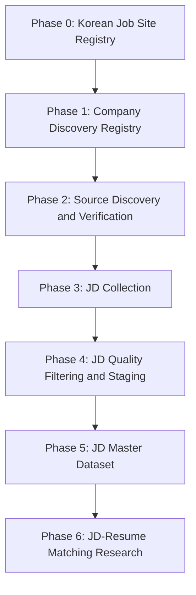

# AI Hiring Market Pipeline

Biz-Voyager-style AI hiring market data pipeline with stricter source compliance review for the HEDING x ModuLabs AIFFELTHON matching MVP and research project.

The long-term goal is to legally collect, validate, normalize, structure, and prepare AI-related job descriptions (JDs) from approved sources so they can later be matched with AI candidate resumes.

This project is not designed for massive crawling. It is designed around:

- recall-first discovery
- evidence-first promotion
- company-first architecture
- source compliance first
- staging/master separation
- explainability
- conservative collection policy

No crawler, scraper, API integration, browser automation, LLM API integration, Google Sheets API integration, CAPTCHA bypass, anti-bot evasion, login automation, or live collection is implemented in the current design phase.

## Final Pipeline Architecture

```text
Phase 0 — Korean Job Site Registry
↓
Phase 1 — Company Discovery Registry
↓
Phase 2 — Source Discovery and Verification
↓
Phase 3 — JD Collection
↓
Phase 4 — JD Quality Filtering and Staging
↓
Phase 5 — JD Master Dataset
↓
Phase 6 — JD-Resume Matching Research
```



The project follows Biz-Voyager's broad discovery -> evidence review -> screening -> staging -> master philosophy, but applies stricter legal and policy gates before any JD collection.

## Phase 0 — Korean Job Site Registry

Goal:
Build a legally reviewable Korean job-site universe before any collection.

Flow:

```text
raw_job_site_discovery
-> site_policy_evidence
-> job_site_registry_staging
-> site_screening
-> master/job_source_registry
```

Purpose:

- discover Korean job posting sources broadly
- review robots.txt and Terms of Service
- classify source risk
- approve only operable sources

Outputs:

- `runtime/raw_job_site_discovery.csv`
- `runtime/site_policy_evidence.csv`
- `staging/job_site_registry_staging.csv`
- `master/job_source_registry.csv`

Core checks:

- robots.txt
- Terms of Service
- API requirement
- login requirement
- CAPTCHA
- anti-bot
- public HTML access
- dynamic rendering risk
- reuse restrictions

Source grades:

- A — Publicly accessible official source with no approval required
- B — Public ATS or public endpoint
- C — Public company career page with acceptable robots.txt and Terms of Service
- D — Official API or source requiring manual application, approval, contract, institutional access, or API key issuance
- E — General scraping required or policy unclear
- F — Login required, CAPTCHA required, anti-bot bypass required, robots blocked, or Terms of Service prohibit collection

Approval status values:

- `not_required`
- `pending`
- `approved`
- `rejected`
- `expired`

## Phase 1 — Company Discovery Registry

Goal:
Build a broad AI hiring candidate company universe.

Flow:

```text
raw_company_discovery
-> company_evidence_review
-> company_registry_staging
-> company_screening
-> master/company_registry_master
```

Purpose:

- discover AI hiring candidate companies
- preserve evidence traceability
- score companies using explainable signals
- prepare approved companies for source discovery

Discovery routes:

- Route A — Job-site-first: approved job sites -> AI keyword search -> company candidate discovery
- Route B — Company-first: manual seeds -> startup lists -> AI business evidence -> company candidate discovery

Company signal groups:

- `hiring_signal`
- `business_ai_signal`
- `tech_signal`
- `market_signal`
- `research_signal`
- `evidence_quality`

Company status:

- `seeded`
- `candidate`
- `needs_review`
- `approved_for_source_discovery`
- `rejected`

Outputs:

- `runtime/raw_company_discovery.csv`
- `runtime/company_candidates.csv`
- `runtime/company_evidence.csv`
- `staging/company_registry_staging.csv`
- `master/company_registry_master.csv`

## Phase 2 — Source Discovery and Verification

Goal:
Find and verify each approved company's job posting source.

Flow:

```text
approved company registry
-> source discovery
-> source evidence collection
-> source verification
-> source registry staging
-> approved source registry
```

Source types:

- official company career page
- Greenhouse
- Lever
- Ashby
- Work24
- public ATS endpoints
- RSS/sitemap job feeds

Verification checks:

- official domain match
- robots compatibility
- ToS compatibility
- ATS identification
- public access
- HTML structure quality
- AI JD availability
- maintenance risk

Source grades:

- A — Publicly accessible official source with no approval required
- B — Public ATS or public endpoint
- C — Public company career page with acceptable robots.txt and Terms of Service
- D — Official API or source requiring manual application, approval, contract, institutional access, or API key issuance
- E — General scraping required or policy unclear
- F — Login required, CAPTCHA required, anti-bot bypass required, robots blocked, or Terms of Service prohibit collection

Only Grade A can be considered directly usable without manual approval. "Carefully reviewed" means human approval is required.

Use policy:

- Grade A: usable after basic automated checks
- Grade B: requires human review before use
- Grade C: requires human review and explicit approval before use
- Grade D: approval pending / manual approval required
- Grade E: avoid in MVP
- Grade F: prohibited

Approval status values:

- `not_required`
- `pending`
- `approved`
- `rejected`
- `expired`

A source must not move to an approved source registry unless:

- `source_grade` is A and automated checks passed, or
- `source_grade` is B, C, or D and human `approval_status` is `approved`.

Outputs:

- `runtime/source_discovery.csv`
- `runtime/source_policy_evidence.csv`
- `runtime/source_verification.csv`
- `staging/source_registry_staging.csv`
- `master/source_registry_master.csv`

## Phase 3 — JD Collection

Goal:
Collect AI-related public JD candidates only from approved sources.

Flow:

```text
approved source registry
-> JD fetch
-> JD parse
-> JD normalize
-> raw JD storage
```

Collection policy:

- conservative request rate
- no CAPTCHA solving
- no anti-bot bypass
- no login automation
- no hidden endpoints
- no prohibited scraping

Collectors:

- `base_collector.py`
- `work24_collector.py`
- `greenhouse_collector.py`
- `lever_collector.py`
- `ashby_collector.py`
- `company_career_collector.py`

Outputs:

- `data/raw/raw_jds.csv`
- `runtime/jd_collection_log.csv`

## Phase 4 — JD Quality Filtering and Staging

Goal:
Filter unusable, non-AI, duplicate, and low-quality JDs.

Flow:

```text
raw JDs
-> schema validation
-> AI role filtering
-> deduplication
-> text cleaning
-> staging
```

Validation rules:

- required fields exist
- minimum description length
- AI keyword match
- taxonomy match
- source approved
- duplicate removal

AI role groups:

- AI Engineer
- AI Researcher
- AI Scientist
- AI Analyst

Outputs:

- `data/cleaned/cleaned_jds.csv`
- `staging/jd_staging.csv`
- `runtime/jd_validation_errors.csv`

## Phase 5 — JD Master Dataset

Goal:
Promote only validated high-quality AI JDs.

Flow:

```text
jd_staging
-> quality gate
-> master promotion
-> master dataset
```

Promotion conditions:

- approved source
- valid schema
- AI role classified
- duplicate removed
- quality score threshold passed

Outputs:

- `master/jd_master_dataset.csv`
- `data/labeled/labeled_jds.csv`

## Phase 6 — JD-Resume Matching Research

Goal:
Prepare structured JD datasets for future resume matching.

Future tasks:

- taxonomy alignment
- skill normalization
- embedding generation
- semantic similarity
- resume-JD ranking
- candidate recommendation

Inputs:

- `master/jd_master_dataset.csv`
- resume datasets
- `configs/taxonomy_v1.yaml`

## Global Operating Principles

1. Recall-first discovery
Collect broadly first. Filter later with evidence and quality gates.

2. Evidence-first promotion
Nothing moves to master without evidence.

3. Company-first architecture
Company relevance comes before JD collection.

4. Source compliance first
No source enters collection without review.

   Grade A can proceed after basic automated checks. Grades B, C, and D require human approval before use. Grade E is rejected for the MVP unless later re-reviewed. Grade F is prohibited.

5. Staging/master separation
Never write raw data directly into master.

6. Explainability
Every company, source, and JD must preserve why it was discovered, why it was approved, and where it came from.

7. Conservative collection policy
No illegal scraping, anti-bot evasion, CAPTCHA bypass, or login automation.

## Directory Structure

```text
ai-hiring-market-pipeline/
  README.md

  docs/
    phase0_job_source_registry.md
    phase1_company_discovery.md
    phase2_source_discovery_verification.md
    phase3_jd_collection.md
    phase4_jd_quality_gate.md
    phase5_master_dataset.md
    phase6_jd_resume_matching_research.md
    pipeline_operations.md
    legal_and_ethics_policy.md
    source_selection_criteria.md
    taxonomy_v1.md

  configs/
    company_signal_schema.yml
    ai_keywords.yaml
    taxonomy_v1.yaml
    source_rules.yaml

  runtime/
    raw_job_site_discovery.csv
    site_policy_evidence.csv
    raw_company_discovery.csv
    company_candidates.csv
    company_evidence.csv
    source_discovery.csv
    source_policy_evidence.csv
    source_verification.csv
    raw_jd_collection.csv
    jd_collection_log.csv
    jd_validation_errors.csv
    quality_gate_report.csv
    runs.csv
    errors.csv

  staging/
    job_site_registry_staging.csv
    company_registry_staging.csv
    source_registry_staging.csv
    jd_staging.csv

  master/
    job_source_registry.csv
    company_registry_master.csv
    source_registry_master.csv
    jd_master_dataset.csv

  data/
    raw/
    cleaned/
    labeled/
    logs/

  src/
    company_discovery/
    registry/
    collectors/
    processing/
    labeling/
    storage/
    utils/

  tests/
  notebooks/
  scripts/
```

## Setup

```bash
python -m venv .venv
pip install -r requirements.txt
```

Optional environment variables should be placed in a local `.env` file. Do not commit real API keys.

```bash
CONTACT_EMAIL=your-email@example.com
WORKNET_API_KEY=optional-public-api-key
```

## Starter Commands

Initialize company registry templates:

```bash
python scripts/init_company_registry.py
```

Initialize source registry template:

```bash
python scripts/init_source_registry.py
```

Validate existing local CSV outputs:

```bash
python scripts/run_validation.py
```

`scripts/run_collection.py` is intentionally conservative in this MVP scaffold. It does not run broad crawling. It exists only as a future entry point for approved sources.
